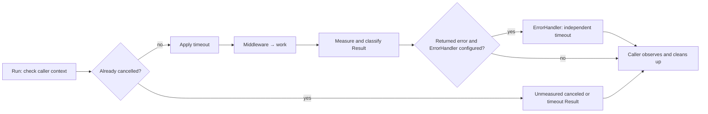

# job

[](https://pkg.go.dev/github.com/uchaloop/job) [](https://github.com/uchaloop/job/actions/workflows/ci.yml) [](https://github.com/uchaloop/job/tags) [](LICENSE)

[Install](#installation) · [Quick start](#quick-start) · [How it works](#how-it-works) · [Configuration](#configuration) · [Examples](#documentation)

One attempt at a piece of work, and nothing about when the next one happens.

A short-lived process started by a Kubernetes CronJob runs one attempt and
exits. [beat](https://github.com/uchaloop/beat) runs the same work repeatedly
inside a long-lived process. Both drive the same `Runner`, so the work, its
middleware, its timeout and its classification are written once.

- **One attempt per call** - no retry, no goroutine of its own, no automatic observability Handler call.
- **A cooperative timeout** - it cancels the attempt's context and says so even
  when the work stayed quiet about it.
- **No dependencies** beyond the standard library and `uchaloop/validate`.

## Installation

Requires Go 1.27 or later.

```bash
go get github.com/uchaloop/job
```

## Quick start

```go
package main

import (
    "context"
    "log/slog"
    "time"

    "github.com/uchaloop/job"
)

func main() {
    runner, err := job.MakeRunner(
        job.Config{Timeout: 3 * time.Minute},
        func(ctx context.Context) (int, error) {
            // Replace with one batch of application work.
            return 0, ctx.Err()
        },
    )
    if err != nil {
        slog.Error("configure job", "error", err)
        return
    }
    result := runner.Run(context.Background())
    slog.Info("attempt finished", "outcome", result.Outcome, "processed", result.Processed)
}
```

## How it works



## The contract

`Run` calls the chain at most once, synchronously, and waits for it to return.
A caller's context that is already done skips the work entirely and reports why,
measuring nothing.

| Field | Meaning |
|---|---|
| `Start`, `Duration` | Start and total duration, including optional ErrorHandler |
| `WorkDuration`, `ErrorHandlerDuration` | Time spent in each stage |
| `ErrorHandlerErr` | Callback error and/or expired callback context, separate from the work error |
| `Processed` | What the work reported, kept even when it then failed |
| `Err` | The chain's error, which stays nil when a timeout cut a quiet Func short |
| `Outcome` | `ok`, `error`, `panic`, `timeout` or `canceled` - authoritative |

> [!IMPORTANT]
> A timeout cancels the context; it cannot interrupt the function.
 Work must return when its context is done and
must wait for its own goroutines first. Work that ignores cancellation holds its
caller for as long as it likes, and no result is reported until it returns.

Outcome, not `Err`, decides whether an attempt succeeded. Classification uses
this precedence after the chain returns:

| Outcome | Condition |
|---|---|
| `panic` | Error contains a recovered `*job.PanicError` |
| `timeout` | Attempt context deadline expired, including an earlier caller deadline |
| `canceled` | Attempt context was cancelled |
| `error` | Chain returned another non-nil error |
| `ok` | None of the above |

A deadline can therefore produce `timeout` even when `Err` is nil.

## Error handling

An optional callback can log an error or persist application-defined data in a
DLQ. The library does not define the message format or retry delivery.

```go
runner, err := job.MakeRunner(
    job.Config{Timeout: time.Minute, ErrorHandlerTimeout: 15 * time.Second},
    work,
    job.WithErrorHandler(func(ctx context.Context, err error) error {
        return failures.Store(ctx, err) // Application-owned storage and error model.
    }),
)
```

The callback runs synchronously once, only for a non-nil error returned by the
work or middleware. It gets caller context values and a fresh deadline, without
inheriting cancellation. A work timeout returning nil does not call it; work
skipped because the caller was already cancelled does not call it either.

> [!IMPORTANT]
> Error processing has its own budget, even during shutdown. Allow time for both
> stages before closing dependencies. Neither context can force code to return.

`Err` and `Outcome` retain the original work result. `ErrorHandlerErr` reports
callback failure, joining its returned error with context expiration. Successful
DLQ delivery does not turn failed work into success. `Duration` includes both
stages, so schedulers account for error processing too. Persistence and source
acknowledgement remain application responsibilities; this callback alone does
not guarantee delivery. Recovery middleware does not cover callback panics.

## Panics

They propagate by default. To turn one into a `*job.PanicError` on the result
instead, add `job/middleware/recovery`:

```go
job.WithMiddleware(recovery.Middleware(recovery.WithLogger(logger)))
```

It protects only the wrapped work - not a handler, not goroutines the work
started.

## Choosing which process runs the work

`job/assignment` is an optional, pure policy for a deployment that runs in
several clusters: one cluster owns each scheduled point, and all of its replicas
run it.

```go
rotation, err := assignment.MakeRotation(assignment.Config{
    Clusters: []string{"el", "xc", "dm"},
    Current:  "el",
    Period:   4 * time.Hour,
})
if err != nil {
    return err
}

decision, err := rotation.Decide(assignment.Invocation{ScheduledFor: point})
if err != nil {
    return err
}
// Call Runner.Run only when decision.Execute is true.
```

It reads no clock and keeps no state, so every process computes the same answer
from the same configuration - nothing is coordinated at run time. It decides who
should try, not that anyone did: a cluster that is down leaves its points
unserved, and no other cluster takes over. Work must survive a skipped attempt.

The caller passes the **scheduled point**, never the current time, so a pod that
starts late and a retry of the same scheduled Job decide as the original point
did.

Changing the cluster list or period can produce duplicates or gaps while old
and new configurations coexist. Stop scheduling across all clusters, update
the configuration everywhere, then resume; accept the pause. There is no
configuration agreement protocol or automatic failover.

## Configuration

| Field | Default env name | Default |
|---|---|---|
| `Timeout` | `JOB_TIMEOUT` | `1m` |
| `ErrorHandlerTimeout` | `JOB_ERROR_HANDLER_TIMEOUT` | `1m` |

`job.MakeRunner` accepts ordinary Go values and never reads the environment.
The env name above applies only when using the optional loader below.

## Uber Fx

The optional [jobfx](https://github.com/uchaloop/jobfx) adapter is a separate
module. The job module has no Fx dependency.

```sh
go get github.com/uchaloop/jobfx@v0.1.0
```

Provide `job.Config` and `job.Func`, then use `jobfx.Module()` and
`fx.Populate(&runner)`. The application starts dependencies, calls `runner.Run`
once, observes the result and stops dependencies with a fresh cleanup budget.
The adapter's executable example uses `app.Wait()` for Fx shutdown requests.

## Documentation

The contract, the outcomes and the reasons behind them are in the package
documentation:
**[pkg.go.dev/github.com/uchaloop/job](https://pkg.go.dev/github.com/uchaloop/job)**.

## Recommended configuration

> [!TIP]
> We recommend [confmaker](https://github.com/uchaloop/confmaker) for typed ENV
> configuration and [confx](https://github.com/uchaloop/confx) for its Fx integration.
> Configuration loading stays in the application; it is optional for the work libraries.

<details>
<summary><strong>Configure from ENV with confmaker / confx</strong></summary>

The ordinary `job.Config{...}` in the quick start can be replaced with:

```go
cfg, err := confmaker.Load[job.Config]()
if err != nil {
    return err
}
// Pass cfg to job.MakeRunner.
```

Import `github.com/uchaloop/confmaker`. No Fx dependency is needed.

Example environment: `JOB_TIMEOUT=3m`.

For an Fx application, replace `fx.Supply(job.Config{...})` with:

```go
confx.Module(),
confx.Provide[job.Config](),
```

Import `github.com/uchaloop/confx` and include `confx.Module()` once per application.

</details>

## Related libraries

| Library | Purpose |
|---|---|
| [beat](https://github.com/uchaloop/beat) | Run the same work on a schedule |
| [jobfx](https://github.com/uchaloop/jobfx) | Provide a Runner through Fx |

## License

[MIT](LICENSE)
